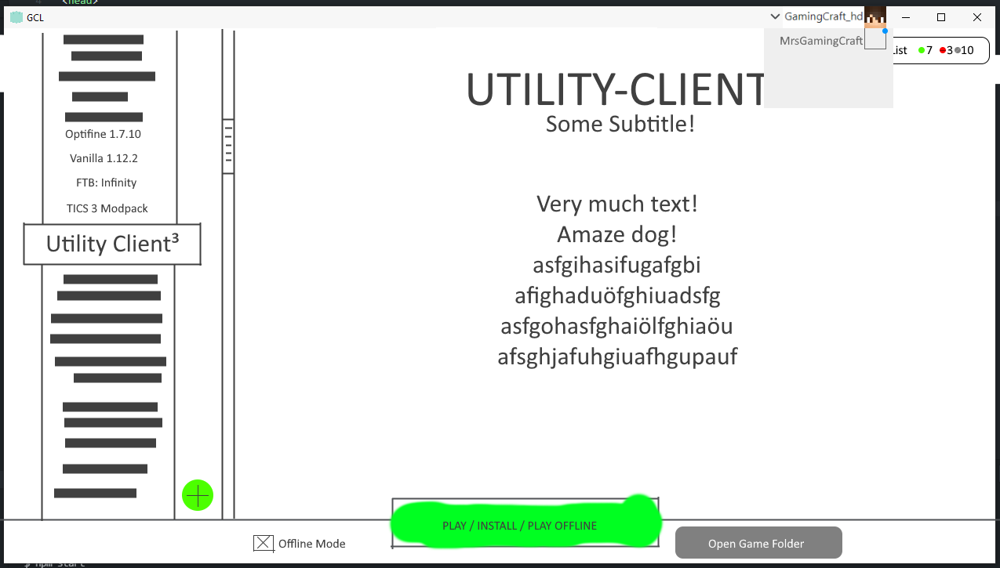

# GamingCraft Launcher - [Releases](https://www.github.com/GamingCrafthd/gcl/releases)

## To Use

To clone and run this repository you'll need [Git](https://git-scm.com) and [Node.js](https://nodejs.org/en/download/) (which comes with [npm](http://npmjs.com)) installed on your computer. From your command line:

```bash
# Clone this repository
git clone https://github.com/GamingCrafthd/gcl
# Go into the repository
cd electron-quick-start
# Install dependencies
npm install
# Run the app
npm start
```

Note: If you're using Linux Bash for Windows, [see this guide](https://www.howtogeek.com/261575/how-to-run-graphical-linux-desktop-applications-from-windows-10s-bash-shell/) or use `node` from the command prompt or the power shell.

## Concept Art


## Contributers
### Developers
- [GamingCraft_hd](https://www.gamingcraft.de/)

### Maintainers
*None yet, become a maintainer by being active and making meaningful commits*

### Contributers
*Become a contributer by forking this repo and making pull requests.*